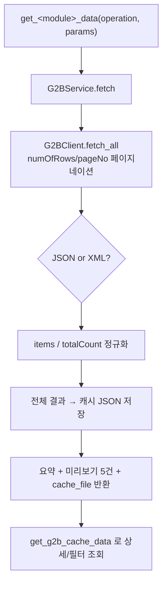

한국어 | [English](README_en.md)

# MCP 조달청 나라장터 (KR-G2B)


조달청 **나라장터(국가종합전자조달, G2B)** 및 **누리장터(민간조달)** OpenAPI를 위한 Model Context Protocol(MCP) 서버입니다. 공공데이터포털(data.go.kr)을 통해 제공되는 조달청 14개 서비스, **156개 오퍼레이션**을 AI 어시스턴트가 자연어로 조회·분석할 수 있게 합니다.

입찰공고·사전규격·낙찰·계약·발주계획·가격정보·공공조달통계까지, 공공조달 전 과정의 데이터를 하나의 MCP로 연결합니다.

## 사용 예시

AI 어시스턴트에게 다음과 같은 요청을 할 수 있습니다:

- **📢 입찰공고 검색** — "2024년 1월에 올라온 공사 입찰공고를 찾아줘"
- **🏆 낙찰 분석** — "특정 수요기관의 최근 물품 낙찰 현황을 정리해줘"
- **📄 계약 조회** — "지난달 체결된 용역 계약 내역을 보여줘"
- **💰 가격정보** — "시설자재(토목) 가격정보를 조회해줘"
- **📊 조달통계** — "기관 구분별 공공조달 실적 통계를 알려줘"
- **🏗️ 사전규격** — "발주 예정인 사전규격(사전공개) 목록을 확인해줘"

## 지원 서비스

조달청 OpenAPI 14개 서비스를 모두 포함합니다. 각 서비스는 `get_<module>_data` 도구 하나로 호출하며, `operation` 파라미터로 세부 오퍼레이션을 지정합니다.

| 구분 | 서비스 | 도구 | 오퍼레이션 |
|------|--------|------|:---------:|
| **나라장터** | 입찰공고정보서비스 | `get_bid_data` | 25 |
| | 사전규격정보서비스 | `get_prestd_data` | 20 |
| | 낙찰정보서비스 | `get_scsbid_data` | 23 |
| | 계약정보서비스 | `get_contract_data` | 21 |
| | 계약과정 통합공개서비스 | `get_contract_process_data` | 4 |
| | 발주계획 현황서비스 | `get_order_plan_data` | 8 |
| | 가격정보 현황서비스 | `get_price_data` | 11 |
| | 공공데이터 개방표준서비스 | `get_data_standard_data` | 3 |
| | 업종 및 근거법규서비스 | `get_industry_data` | 1 |
| | 사용자정보서비스 | `get_user_info_data` | 5 |
| **공공조달** | 공공조달통계정보서비스 | `get_stats_data` | 14 |
| **누리장터** | 민간입찰공고서비스 | `get_nuri_bid_data` | 10 |
| | 민간낙찰정보서비스 | `get_nuri_scsbid_data` | 7 |
| | 민간계약정보서비스 | `get_nuri_contract_data` | 4 |

### 디스커버리·캐시 도구

| 도구 | 설명 |
|------|------|
| `list_g2b_services` | 14개 서비스와 오퍼레이션 개요 목록 (탐색 시작점) |
| `get_g2b_operation_info` | 특정 오퍼레이션의 요청 파라미터·필수여부·응답 필드·예제 URL |
| `get_g2b_cache_data` | 저장된 조회 결과 캐시를 필드 필터/페이지 단위로 상세 조회 |

## 권장 사용 흐름

```
1. list_g2b_services()                         → 어떤 서비스/오퍼레이션이 있는지 파악
2. get_g2b_operation_info("bid", "getBidPblancListInfoCnstwk")
                                               → 정확한 파라미터(필수/선택) 확인
3. get_bid_data(operation="getBidPblancListInfoCnstwk",
                params={"inqryDiv": "1",
                        "inqryBgnDt": "202401010000",
                        "inqryEndDt": "202401312359"})
                                               → 전체 페이지 수집 + 캐시 저장 + 요약 반환
4. get_g2b_cache_data(cache_file="...",        → 캐시에서 상세/필터 조회
                      field_name="dminsttNm",
                      field_value_substring="서울")
```

대량 결과는 LLM 컨텍스트를 보호하기 위해 **요약 + 미리보기 5건 + 캐시 파일 경로**만 반환하며, 전체 데이터는 캐시 파일에 저장되어 `get_g2b_cache_data` 로 탐색합니다.

### 키워드 정밀도 보정 & 의미 기반 리랭커

조달청 검색 API의 공고명(`bidNtceNm`) 필터는 **단순 부분일치**라 노이즈가 섞입니다 — 예: `재활` → `재활용`(폐기물), `투자` → `투자유치/투자설명회`. `get_g2b_cache_data` 가 이를 보정합니다.

```text
# 1) 어휘 필터 (의존성 없음, 기본 제공)
get_g2b_cache_data(cache_file, field_name="bidNtceNm",
                   exclude_substrings=["재활용","직업재활시설"])      # 노이즈 제거
get_g2b_cache_data(cache_file, field_value_regex="재활(?!용)")        # 정밀 매칭

# 2) 의미 기반 재정렬 (선택 설치: pip install "mcp-kr-g2b[ml]")
get_g2b_cache_data(cache_file,
                   rerank_query="디지털 헬스케어 AI 근골격계 재활 동작분석")
#  → 회사/사업 설명문과의 유사도(ko-sroberta 임베딩)로 적합도 순 정렬 + _relevance 점수
```

> 리랭커는 `sentence-transformers`(torch 포함)가 필요해 기본 설치에서 제외했습니다. 미설치 시 `rerank_query` 호출은 설치 안내를 반환하고, 그 외 기능은 정상 동작합니다. 모델은 `G2B_RERANK_MODEL`(기본 `jhgan/ko-sroberta-multitask`)로 변경할 수 있습니다.

## 빠른 시작 가이드

### 1. 인증 설정 (서비스키 발급)

조달청 OpenAPI는 **공공데이터포털**을 통해 제공됩니다.

1. [공공데이터포털](https://www.data.go.kr) 회원가입
2. 사용할 조달청 서비스(예: "나라장터 입찰공고정보서비스")를 검색하여 **활용신청**
3. 마이페이지 → 오픈API → 인증키에서 **일반 인증키(Encoding)** 확인
4. 부동산(mcp-kr-realestate) 서버와 동일한 키를 공유할 수 있습니다.

> **참고**: 서비스마다 활용신청 승인이 필요합니다. 승인되지 않은 서비스 호출 시 `20 서비스 접근 거부` 에러가 반환됩니다.

### 2. 설치

```bash
# 저장소 복제
git clone https://github.com/ChangooLee/mcp-kr-g2b.git
cd mcp-kr-g2b

# Python 3.10 이상 필수
python3 -m venv .venv
source .venv/bin/activate

# 패키지 설치
python3 -m pip install --upgrade pip
pip install -e .
```

### 3. 환경변수 설정

`.env.example` 을 복사하여 `.env` 를 만들고 서비스키를 입력합니다.

```bash
cp .env.example .env
# .env 편집: PUBLIC_DATA_API_KEY_ENCODED=발급받은_Encoding_키
```

## IDE 통합

### Claude Desktop 설정

햄버거 메뉴(☰) > Settings > Developer > "Edit Config" 에서 추가:

```json
{
  "mcpServers": {
    "mcp-kr-g2b": {
      "command": "YOUR_LOCATION/.venv/bin/mcp-kr-g2b",
      "env": {
        "PUBLIC_DATA_API_KEY_ENCODED": "발급받은_Encoding_서비스키",
        "TRANSPORT": "stdio",
        "LOG_LEVEL": "INFO",
        "MCP_SERVER_NAME": "mcp-kr-g2b"
      }
    }
  }
}
```

### Streamable HTTP (선택)

```json
{
  "mcpServers": {
    "mcp-kr-g2b": {
      "command": "YOUR_LOCATION/.venv/bin/mcp-kr-g2b",
      "env": {
        "PUBLIC_DATA_API_KEY_ENCODED": "발급받은_Encoding_서비스키",
        "HOST": "0.0.0.0",
        "PORT": "8002",
        "TRANSPORT": "streamable-http",
        "LOG_LEVEL": "INFO",
        "MCP_SERVER_NAME": "mcp-kr-g2b"
      }
    }
  }
}
```

> [!NOTE]
> - `YOUR_LOCATION`: 가상환경이 설치된 실제 경로로 변경
> - `TRANSPORT="streamable-http"` 설정 시 엔드포인트는 `http://HOST:PORT/mcp`

### 주요 환경 변수

| 변수 | 설명 | 기본값 |
|------|------|--------|
| `PUBLIC_DATA_API_KEY_ENCODED` | 공공데이터포털 서비스키(Encoding). `G2B_SERVICE_KEY` 로도 지정 가능 | (필수) |
| `G2B_NUM_OF_ROWS` | 페이지당 결과 수(최대 999) | 500 |
| `G2B_MAX_PAGES` | 전체 조회 시 최대 페이지 수 | 50 |
| `G2B_REQUEST_TIMEOUT` | 요청 타임아웃(초) | 60 |
| `MCP_G2B_CACHE_DIR` | 캐시 디렉토리 | 패키지 내부 |
| `HOST` / `PORT` | 서버 호스트/포트 | 0.0.0.0 / 8002 |
| `TRANSPORT` | `stdio` 또는 `streamable-http` | stdio |
| `LOG_LEVEL` | 로깅 레벨 | INFO |

## Docker로 실행하기

```bash
# 이미지 빌드
docker build -t mcp-kr-g2b:latest .

# .env 파일 사용(권장)
docker run -d \
  --name mcp-kr-g2b \
  -p 8002:8002 \
  --env-file .env \
  -e TRANSPORT=streamable-http \
  mcp-kr-g2b:latest

# 또는 환경변수 직접 전달
docker run -d \
  --name mcp-kr-g2b \
  -p 8002:8002 \
  -e PUBLIC_DATA_API_KEY_ENCODED=your-encoded-key \
  -e TRANSPORT=streamable-http \
  mcp-kr-g2b:latest
```

## 아키텍처

`mcp-opendart` 의 모듈 구조와 `mcp-kr-realestate` 의 공공데이터포털 호출/캐싱 전략을 결합했습니다.

```
src/mcp_kr_g2b/
├── server.py              # FastMCP 엔트리, G2BContext(전역 컨텍스트), 도구 등록
├── config.py              # G2BConfig / MCPConfig (환경변수)
├── apis/
│   ├── client.py          # 공공데이터포털 클라이언트(curl 우선 + requests 폴백,
│   │                      #   serviceKey 처리, JSON/XML 자동판별, 페이지네이션)
│   └── service.py         # G2BService: 번들 명세 기반 제네릭 서비스 호출
├── tools/
│   ├── <module>_tools.py  # 서비스별 get_<module>_data 도구 (14개, 코드 생성)
│   ├── common_tools.py    # list_g2b_services / get_g2b_operation_info / get_g2b_cache_data
│   └── _helpers.py        # 디스패치·요약·설명 생성 공통 로직
├── registry/              # 156개 오퍼레이션 카탈로그(ToolRegistry)
├── specs/                 # 조달청 OpenAPI 명세(JSON, 원본 .docx 파싱 결과)
└── utils/
    ├── cache.py           # 조회 결과 캐싱(raw → JSON 파일) + 요약
    └── ctx_helper.py      # 컨텍스트 폴백, as_json_text
```

### 호출·캐싱 흐름



## 문제 해결 및 디버깅

조달청 OpenAPI는 공통 에러코드를 사용합니다:

| 코드 | 의미 | 조치 |
|:---:|------|------|
| `00` | 정상 | - |
| `03` / `07` | 데이터 없음 / 입력범위 초과 | 조회조건(기간 등) 확인 (빈 결과로 처리) |
| `10`~`12` | 잘못된 요청 / 필수 파라미터 누락 | `get_g2b_operation_info` 로 필수 파라미터 확인 |
| `20` | 서비스 접근 거부 | 해당 서비스 **활용신청 승인** 여부 확인 |
| `22` | 요청 제한 초과 | 일일 트래픽 한도 확인 |
| `30`/`31` | 등록되지 않은/만료된 서비스키 | 키 값 및 인코딩(Encoding 키 사용) 확인 |

```bash
# 상세 로깅
export LOG_LEVEL=DEBUG
```

> **인증키 인코딩**: 본 서버는 **Encoding(URL 인코딩) 키**를 그대로 사용하도록 설계되었습니다. `%2B`, `%2F`, `%3D` 등이 포함된 키를 그대로 환경변수에 넣으세요.

## 보안

- 서비스키를 절대 공유하지 마세요.
- `.env` 파일을 안전하게 보관하고 저장소에 커밋하지 마세요(`.gitignore` 적용됨).
- API 사용량(일일 트래픽)을 모니터링하세요.

## 라이선스

이 프로젝트는 **비상업적, 개인, 연구/학습, 비영리 목적**에 한해 사용할 수 있습니다(CC BY-NC 4.0). 상업적 사용은 금지됩니다. 자세한 내용은 [LICENSE](LICENSE)를 참고하세요.

이 프로젝트는 공식 조달청 제품이 아닙니다. 데이터의 정확성·최신성은 공공데이터포털 및 조달청 원본을 기준으로 합니다.
